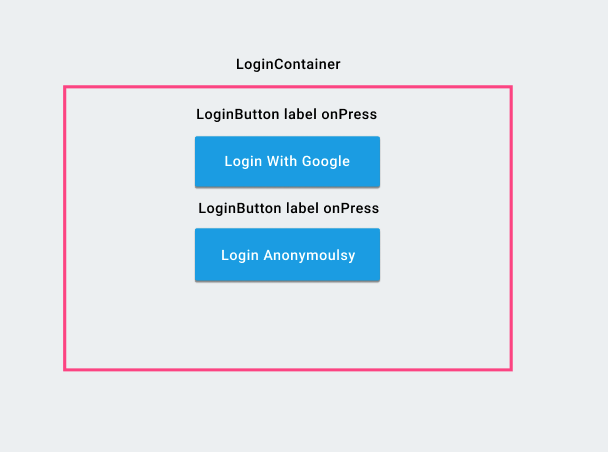

# Implementing the UI

We will be using [@material-ui](https://material-ui.com) to quickly get something decent looking.

### Before Authentication Page

When the user is not authenticated we have 3 components to render as shown in the image below.

The components to be used are : 

* 1x LoginContainer
* 2x Button 



This is my quick and dirty attempt : 

```jsx
const UnAuthedPage = () => {
  return (
    <State initial={{ isLoading: false, error: null }}>
      {({ state, setState }) => (
        <div
          style={{
            width: 600,
            height: 300,
            display: "flex",
            alignContent: "center",
            justifyContent: "space-around",
            flexDirection: "column"
          }}
        >
          <div>isLoading : {JSON.stringify(state.isLoading)}</div>
          <div>error : {JSON.stringify(state.error)}</div>
          <Button
            variant="contained"
            style={{
              width: 200,
              height: 80,
              alignSelf: "center",
              background: "#039BE5",
              color: "white"
            }}
            onClick={async () => {
              setState({ isLoading: true, error: null });
              await firebase
                .app()
                .auth()
                .signInAnonymously();
              setState({ isLoading: false, error: null });
            }}
          >
            Login Anonymously
          </Button>
          <Button
            style={{
              width: 200,
              height: 80,
              alignSelf: "center",
              background: "#039BE5",
              color: "white"
            }}
            onClick={async () => {
              try {
                setState({ isLoading: true, error: null });
                const googleAuthProvider = new firebase.auth.GoogleAuthProvider();
                await firebase.auth().signInWithPopup(googleAuthProvider);
                // setState({ isLoading: false, error: null });
              } catch (error) {
                setState({ isLoading: false, error: error });
              }
            }}
          >
            Login With Google
          </Button>
        </div>
      )}
    </State>
  );
};

```

### After Authentication Page

This page is a bit more complex so I won't inline the code here, but you can check [this commit](https://github.com/rakannimer/react-firebase/blob/3264b0a62509c5f321713b10615ba2ce3ee50036/modules/tutorial-bookmarking-app/src/index.tsx) for the full reference.

### By now we should have something that looks like this : 


The  autocomplete component is powered by [Downshift](https://github.com/paypal/downshift).

 

